# Gesccol Web | GESCCOL E.I.C.E

Somos el gestor catastral, habilitado por el IGAC, para realizar las actividades de formación, actualización y conservación catastral, en el municipio de Sahagún – Córdoba. La gestión catastral es un servicio público desarrollado a través de los procesos de formación, actualización, conservación y difusión de la información física, jurídica y económica de los predios, para una mejor administración de los territorios.


<!-- logo del proyecto -->


## Documentacion Técnica del proyecto

### [Despligue en Vivo](http://gesccol.gov.co/)
<!-- tabla de contenido -->

 ### Tabla de contenido
  <ol>
    <li>
      <a href="#aserca-del-proyecto">Aserca del Proyecto</a>
      <ul>
        <li><a href="#tecnologias-usadas">Tecnologias Usadas</a></li>
      </ul>
    </li>
    <li>
      <a href="#como-empezar">Como Empezar</a>
      <ul>
        <li><a href="#prerrequisitos">Prerrequisitos</a></li>
        <li><a href="#instalacion">Instalacion</a></li>
        <li><a href="#configuracion">Configuracion</a></li>
      </ul>
    </li>
    <li>
    <a href="#usage">Uso</a>
        <ul>
        <li><a href="#en-local">En Local</a></li>
        </ul>
    </li>
    <li>
        <a href="#estructura-del-proyecto">Estructura del Proyecto</a>
        <ul>
            <li><a href="#migraciones">Migraciones</a></li>
            <li><a href="#polices">Polices</a></li>
            <li><a href="#seeders">Seeders</a></li>
            <li><a href="#factories">Factories</a></li>
            <li><a href="#modelos">Modelos</a></li>
            <li>
            <a href="#controladores">Controladores</a>
              <ul>
                <li><a href="#controladores-rutas-publicas">Controladores Rutas Publicas</a></li>
                <li><a href="#controladores-rutas-administrador">Controladores Rutas Administrador</a></li>
              </ul>
            </li>
            <li>
            <a href="#vistas">Vistas</a>
                <ul>
                    <li><a href="#publicas">Publicas</a></li>
                    <li><a href="#administrador">Administrador</a></li>
                </ul>
            <li><a href="#plantilla">plantilla</a></li>
            </li>
            <li><a href="#componentes">Componentes</a></li>
            <li>
            <a href="#rutas">Rutas</a>
              <ul>
                <li><a href="#rutas-publicas">Publicas</a></li>
                <li><a href="#rutas-administracion">Administracion</a></li>
              </ul>
            </li>
        </ul>
    </li>
    <li><a href="#licencia">Licencia</a></li>
    <li><a href="">Documentacion para Usuarios</a></li>
    <li><a href="#contacto">Contacto</a></li>
  </ol>

# Aserca del Proyecto

Gesccol web es un sitio contruido para la empresa de gestion catastral GESCCOL E.I.C.E., aqui se detallara la instalacion del proyecto cuando es clonado en un equipo nuevo y se documentara cada uno de los componentes y funciones que posee el proyecto.

### Tecnologias usadas


- php
- Laravel
- JavaScript
- Tailwindscss


# Como Empezar

### Prerrequisitos

1. tener [composer](https://www.bing.com/ck/a?!&&p=8cf26e5eb1674100JmltdHM9MTY2MjU5NTIwMCZpZ3VpZD0xOWYxM2JjMS01MGNmLTYyZWYtM2Y4YS0yOWNiNTE2MDYzMGImaW5zaWQ9NTE4Mg&ptn=3&hsh=3&fclid=19f13bc1-50cf-62ef-3f8a-29cb5160630b&u=a1aHR0cDovL2dldGNvbXBvc2VyLm9yZy8&ntb=1) instalado globalmente
2. Tener Instalado [GIT](https://www.bing.com/ck/a?!&&p=670c722d686c4a66JmltdHM9MTY2MjU5NTIwMCZpZ3VpZD0xOWYxM2JjMS01MGNmLTYyZWYtM2Y4YS0yOWNiNTE2MDYzMGImaW5zaWQ9NTE4Mg&ptn=3&hsh=3&fclid=19f13bc1-50cf-62ef-3f8a-29cb5160630b&u=a1aHR0cHM6Ly9naXQtc2NtLmNvbS8&ntb=1)
3. Contar con un entorno de desarrollo local, recomendable [xampp](https://www.bing.com/ck/a?!&&p=f9330e1dca176511JmltdHM9MTY2MjU5NTIwMCZpZ3VpZD0xOWYxM2JjMS01MGNmLTYyZWYtM2Y4YS0yOWNiNTE2MDYzMGImaW5zaWQ9NTE3Mw&ptn=3&hsh=3&fclid=19f13bc1-50cf-62ef-3f8a-29cb5160630b&u=a1aHR0cHM6Ly93d3cuYXBhY2hlZnJpZW5kcy5vcmcvZG93bmxvYWQuaHRtbA&ntb=1)

## Instalacion

#### Instalar las dependencias del proyecto

Cuando guardas tu proyecto Laravel en un repositorio GIT, en el archivo .gitignore se excluye la carpeta vendor que es donde están las librerías que usa tu proyecto, es por eso que se debe correr en la terminal una instrucción que tome del archivo composer.json todas las referencias de las librerías que deben estar instaladas en tu proyecto.

en la consola escribe el siguiente comando para empezar a instalar esas dependencias

```
composer install
```
## Configuracion

#### Generar arhivos de variables de entorno o .env

Por seguridad el archivo .env está excluido del repositorio, para generar uno nuevo se toma como plantilla el archivo .env.example para copiar este archivo en una nuevo escribe en tu terminal:

```
cp .env.example .env
```

#### Generar Key
Para que tu proyecto en Laravel corra sin problemas es necesario generar una key de seguirdad, para ello en tu terminal corre el siguiente comando:

```
php artisan key:generate
```

#### Base de datos
la base de datos utilizada en este proyecto es MySQL, al intalar xampp este ya trae MySQL por defecto, se debe crear la base de datos de acuerdo con el nombre que se establecio en la variable de entorno ```DB_DATABASE=gesccol_app ``` en el archivo .env

#### Symbolic Link | vinculo simbolico
el proyecto contiene archivos estaticos como imagenes y archivos pdf, por lo que es necesario generar un link simbolico que genere un enlace entre la carpeta storage y la public y que el sistema puede tener accesos a estos archivos.

``` 
php artisan storage:link
 ```
#### Migraciones y Seeders 
para correr las migraciones en la base de datos de las tablas creadas se utiliza el comando 
```
php artisan migrate
```
(opcional) para correr seeder y factories se debe ejecutar el comando

```
php artisan migrate --seed
```


# Uso

## En local
Por medio del entorno de desarrollo xampp se puede ejcutar el proyecto, ***si la instalacion y configuracion fue correcta*** todo deberia ir bien y empezar a incluir nuevas funciones, se recomienda leer todo el codigo del proyecyto que tambien estara documentado, tanto como en esta documentacion como tambien en el mismo codigo para mejor el entendimiento, puede configurar un dominio personalizado desde xampp, [mira este recurso para aprender a hacerlo](https://eliasdorigoni.com/posts/2018-11-12-usar-dominios-personalizados-en-xampp-virtualhost)

Tambien pueden Ejecutar el comando ``` php artisan serve ``` para levantar un servidor local con laravel, sin embargo xampp debe estar encendido para que la base de datos funcione


# Estructura Del Proyecto
Aqui se detallara la estructura del proyecto, sus migraciones, modelos, vistas etc..

## Migraciones

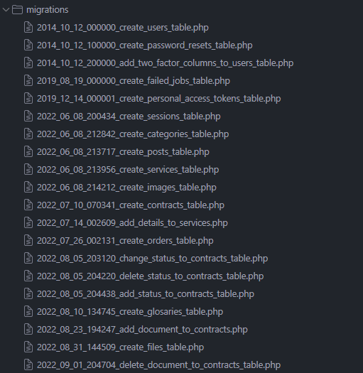

## Polices
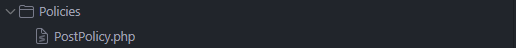

## Seeders

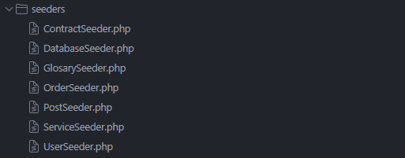

## Factories 
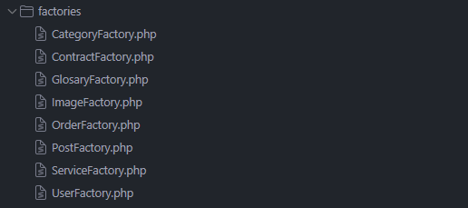

## Modelos 
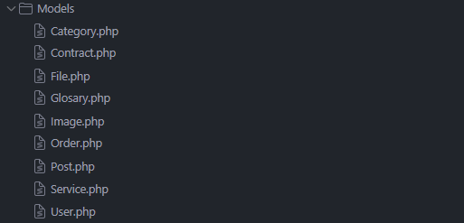

## Controladores 

### Controladores Rutas Publicas
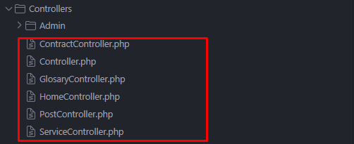

### Controladores Rutas Administrador
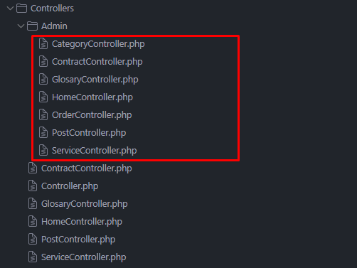

##  Vistas

### Publicas
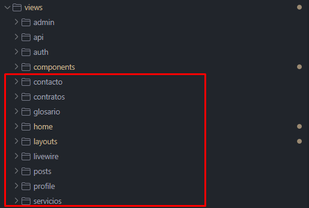

### Administracion
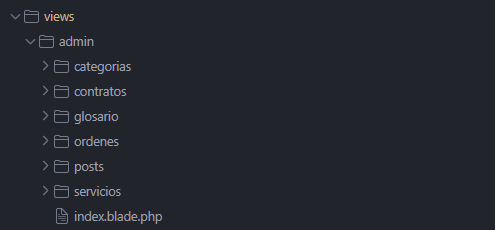

## Plantilla
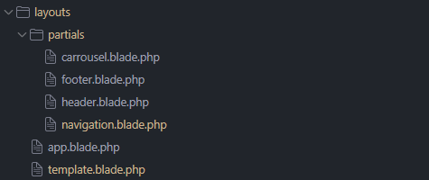

## Componentes
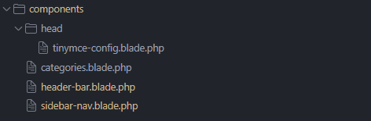
componentes de livewire
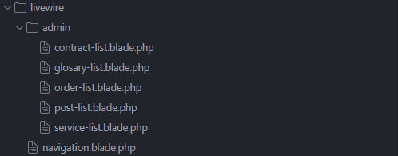

## Rutas

### Rutas Publicas
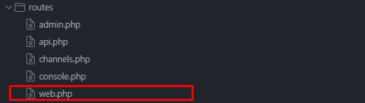

### Rutas Administracion
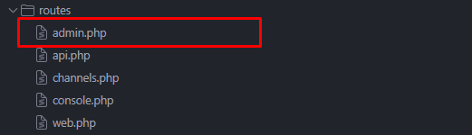


